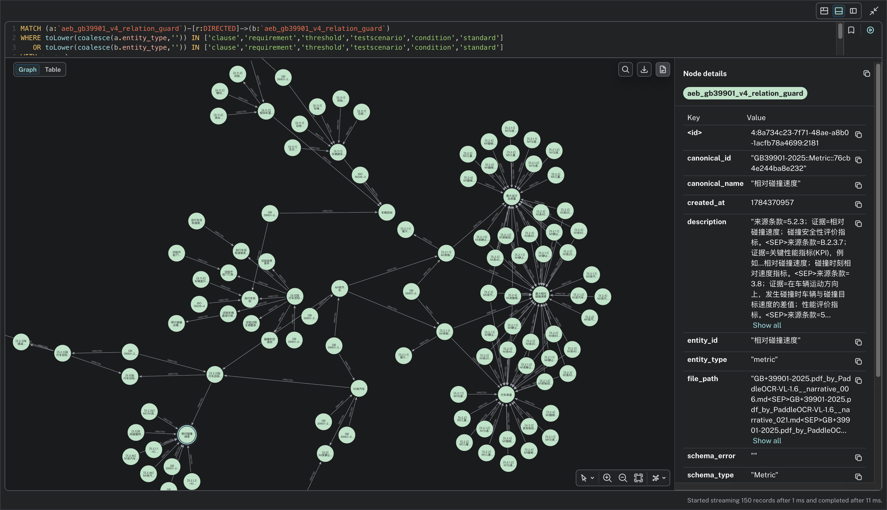
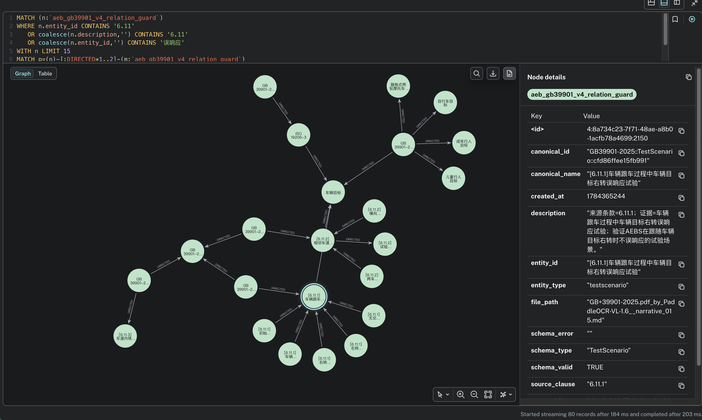

# EvidenceTrail

基于知识图谱增强检索的文档取证 Agent。

面向法规、试验规范等**确定性知识**场景：回答须可回溯至原文；证据不足时拒答，而非编造。

---

## 0. 系统概览

```text
┌─────────────────────────────────────────────────────────────────┐
│                         EvidenceTrail                           │
│                                                                 │
│   PDF ──► OCR ──► Markdown ──► 结构切分 / 入库                   │
│            │                      │                             │
│            │ MinerU               ▼                             │
│            │              ┌──────────────┐  ┌────────────────┐  │
│            │              │ 知识图谱+向量 │◄─│ 领域 schema    │  │
│            │              │ LightRAG     │  │ 关系约束       │  │
│            │              └──────┬───────┘  └────────────────┘  │
│                                  │ 检索                         │
│                                  ▼                              │
│                           ┌──────────────┐                      │
│                           │ Harness Agent│ 规划→检索→反思→门控  │
│                           └──────┬───────┘                      │
│                                  ▼                              │
│                           有据回答 / 拒答                        │
│                                  │                              │
│                                  ▼                              │
│                           ┌──────────────┐                      │
│                           │  Benchmark   │ 离线评测              │
│                           └──────────────┘                      │
└─────────────────────────────────────────────────────────────────┘
```

### 演示与截图

**CLI 取证演示（推荐先看）：** [docs/demo/cli-pipeline-demo.mp4](docs/demo/cli-pipeline-demo.mp4)

本地交互复现：

```bash
cd harness
PYTHONPATH=. python3 -m reg_harness.cli --profile-env ../.env.gb39901_v4 chat
```

**v4 知识图谱（Neo4j，workspace `aeb_gb39901_v4_relation_guard`）：**

| 图 | 说明 |
|----|------|
| [总览](docs/screenshots/neo4j-v4-overview.png) | 条款 / 要求 / 阈值 / 试验等类型子图 |
| [6.11 误响应邻域](docs/screenshots/neo4j-v4-focus-6.11.png) | 与演示题相关的局部关联 |





更多图示：[docs/architecture.svg](docs/architecture.svg) · [docs/screenshots/README.md](docs/screenshots/README.md)

---

## 1. 问题背景

在智能驾驶、车载知识问答及试验规范、标定、诊断等场景中，常见问题形态包括：

- 某工况下的速度阈值是多少？
- 某类误触发如何判定？
- 两项试验要求差异何在？

上述答案通常已写在标准或手册中，属于**闭集、可核对知识**，而非开放域闲聊。若仅依赖模型参数记忆，可能出现条款虚构、数值偏移等错误，工程风险较高。

**目标约束：** 回答须严格依据已入库、可核对的文档内容；证据不足时应明确拒答。

---

## 2. 方案演进

### 2.1 检索增强生成（RAG）

为降低对参数记忆的依赖，采用 **RAG**：先从知识库检索相关片段，再据此生成回答。

```text
问题 ──► 检索 ──► 生成
```

基础 RAG 多为**单次**「问题 → 检索 → 生成」。对长文档与表格密集文本，一轮检索往往覆盖不足；切分不当会导致阈值错读；上下文噪声可能诱发无依据生成；证据不足时仍可能给出确定表述。

### 2.2 引入 Agent 控制环

本项目在检索底座之上增加 **Harness Agent**，将单次问答改为多步取证：

```text
传统 RAG:   问题 ──► 检索 ──► 回答

EvidenceTrail:
  问题 ──► Harness Agent（规划 → 检索 → 反思 → 再决策）──► 有据回答 / 拒答
                    │
                    └──► 图 + 向量检索底座
```

| | 传统 RAG | EvidenceTrail |
|--|----------|----------------|
| 流程 | 单次检索与生成 | 多轮规划、检索与反思 |
| 查询构造 | 多以整句问题检索 | Agent 拆分子问题并选择检索方式 |
| 证据不足 | 易给出确定回答 | 继续取证，或明确拒答 |
| 职责划分 | 检索 + 一次生成 | 检索底座 + Harness 控制层 |

### 2.3 知识图谱、GraphRAG 与 LightRAG

**知识图谱**以实体为节点、关系为边，便于表达「要求—试验—条件—阈值」等结构化关联。

**GraphRAG** 在向量相似检索之外，利用图结构做关联扩展，再回到原文片段供生成使用。

```text
文档 ──► 切分 / 抽取 ──► 知识图谱 + 向量索引
                              │
                   查询：图扩展关联 ──► 原文片段 ──► 生成
```

检索与构图底座采用开源 **[LightRAG](https://github.com/HKUDS/LightRAG)**（切分、实体关系抽取、图/向量存储与查询）。LightRAG 为通用框架；领域实体类型、关系合法性及表格切分策略需在**应用侧**约束。本仓库不修改 LightRAG 核心源码。

### 2.4 文档预处理：PDF 与 OCR

原始材料多为 PDF（扫描件或复杂版式标准/手册），需经 **OCR / 版面解析** 转为结构较好的 Markdown，再进入切分与构图。

本项目使用 **[MinerU](https://github.com/opendatalab/MinerU)**：

| 方式 | 说明 | 链接 |
|------|------|------|
| 在线 | 上传 PDF，导出 Markdown | [https://mineru.net/](https://mineru.net/) |
| 本地部署 | 数据留在本机 | [https://github.com/opendatalab/MinerU](https://github.com/opendatalab/MinerU) |

```text
PDF ──► MinerU（OCR / 版面解析）──► Markdown ──► 结构切分 / 入库
```

样例语料已为 OCR 后的 Markdown（`corpus/prepared/`、`corpus/index_ready/`）。  
说明：仓库中历史导出文件名可能含 `PaddleOCR-VL` 等标记，表示当时的 OCR 产物命名；**推荐复现路径为 MinerU**（上表）。替换自有 PDF 时，先完成 OCR 转换，再执行准备与入库脚本。

### 2.5 构图：LightRAG 默认流程与应用侧改进

**LightRAG 默认流程（面向通用文本）：**

```text
文本 ──► 按长度切块 ──► LLM 抽取实体/关系（类型较宽）──► 图 + 向量
查询 ──► 图扩展 / 向量检索 ──► 片段入上下文 ──► 生成
```

该流程适用于开放语料。用于法规与试验标准时，易出现：表格被长度切分拆散、实体类型过于宽泛、关系噪声高、数值与适用条件分离、出处难以审计。

**应用侧改进（不修改 LightRAG 核心）：**

| 改进项 | 做法 | 目的 |
|--------|------|------|
| 结构切分 | 表格尽量整表入库；叙述按条款/结构单元切分（`prepare_gb39901_v3.py`） | 保持阈值、载荷、车型等条件对齐，降低读表错误 |
| 领域 schema | 条款、试验、阈值、条件等类型与抽取提示（`config/gb_39901_2025_schema.yml`） | 抽取业务对象，而非通用「人物/地点/概念」标签 |
| 关系校验 | 提示白名单 + 写图前过滤（keep / reverse / **drop**，禁止 invent 编边）+ 可选后处理（`schema_guard.py`） | 非法边可审计；宁丢边、不编边 |
| 图检索 + 原文回源 | 图上定位关联后，回填完整原文块，而非仅返回三元组 | 生成依据仍为可核对原文 |

```text
PDF ──► OCR ──► 结构切分 ──► 领域 schema 抽取 ──► 关系校验 ──► 图 + 向量
                                                      │
查询：图扩展关联 ──► 回源原文 ──► Agent 取证 / 门控
```

更换领域时，主要调整 schema 与切分策略；**Agent 控制层按协议复用，不为单题写死剧本**。

样例域 v4 构图结果见文首截图（[总览](docs/screenshots/neo4j-v4-overview.png) / [6.11 邻域](docs/screenshots/neo4j-v4-focus-6.11.png)）。

### 2.6 控制层纪律与评测隔离

控制层只定义角色、工具、拒答条件、步数与护栏，**不**把具体题解关键词写进在线规则（反「瞄靶」）。  
换标准 / 换语料：主要换索引、schema 与切分；不换一套贴题脚本。完整约定见 [harness/PROTOCOL.md](harness/PROTOCOL.md)。

```text
在线：Agent 只读索引与原文 ──► 作答
离线：标准答案 / 参考证据 ──► 事后打分（作答过程不读取）
```

| 项 | 默认 | 含义 |
|----|------|------|
| 决策路径 | skill（模型规划） | `HARNESS_PILOT_HEURISTICS=0`：不注入 pilot 槽位/贴题路由 |
| 证据 catalog | `none` | `HARNESS_CATALOG_MODE=none`：不加载金标 `evidence.jsonl` |
| 条款/表格精查 | 关闭 | `HARNESS_ENABLE_PRECISE_LOOKUP=0`：避免空 catalog 空转或开卷 |

报告结果时建议标明配置档位：

| 档位 | 含义 | 用途 |
|------|------|------|
| P0 | 裸检索/作答模式（无协议 Agent） | 对照基线 |
| **P1** | 协议 Agent（默认 skill，无 gold catalog） | **主结论** |
| P2 | pilot 规则或 gold catalog 等贴题能力 | 仅附录 / 上限参考，不得当作泛化成绩 |

---

## 3. Benchmark 评测

评测分两阶段，职责不同，**阶段二不取代阶段一**。目录：`benchmark/`。

### 3.1 两阶段策略

```text
阶段一：金标小批量（诊断与定型）
  少量带参考答案 / 证据的题目
       │
       ▼
  score_kg / score_retrieval / score_answers
       │
       ▼
  定位问题 ──► 迭代构图或 Agent ──► 方案相对稳定

阶段二：题量扩大（规模化指标，规划中）
  大量题目（可不具备完整金标）
       │
       ▼
  RAGAS 等 reference-free 指标（Faithfulness、Answer Relevancy…）
       │
       ▼
  回归监控、趋势对比、坏 case 粗筛
```

| 阶段 | 数据 | 工具 | 目的 |
|------|------|------|------|
| 一、金标小批量 | 人工/半自动金标 | 自建分层评分（**已落地**） | 找问题、定型方案 |
| 二、扩大题集 | 题多、金标不必齐全 | [RAGAS](https://docs.ragas.io/) 类指标（**计划接入，脚本尚未入库**） | 规模化回归与趋势 |

边界：

- 扩集后仍保留金标子集做抽检校准，避免 judge 模型漂移。  
- RAGAS 类分数衡量的是相对检索上下文的忠实度/切题程度，**不等于**法规数值或条款判定正确。  
- 金标与（未来）RAGAS 打分均在**事后**进行，不进入在线工具链。

### 3.2 评测纪律与检索模式

阶段一除分层 scorer 外，对照实验使用多种检索/作答模式（见 `run_graphrag_benchmark.py`）：

| 模式 | 作用 |
|------|------|
| `closed_book` | 无检索地板（禁伪造引用） |
| `naive` | 纯向量 |
| `hybrid` / `mix` | 图增强检索 |
| `oracle` | 金证据上限（估天花板，非上线能力） |

主张「图带来任务增益」时，应在复杂题上同时观察证据召回、路径完整与最终答案，避免只报单一正确率。  
`KG 分高 ≠ 检索好 ≠ 答对`：三层分数须分开解读。

当前主证据为 **pilot 小集 + 分层脚本**，题目多为 `self_checked`，**未**作为冻结 v1 正式主集；完整 formal 跑分与冻结见 [benchmark/README.md](benchmark/README.md)，**非本版交付门槛**。自动分为结构/词面代理，语义完整需人工复核。

### 3.3 阶段一：数据与脚本

```text
questions.jsonl
      │
      ├── score_kg          图谱质量
      ├── score_retrieval   检索质量
      └── score_answers     问答质量（含 claim / citation / 拒答；
                │            以及相对检索上下文的 faithfulness 代理）
                ▼
         报告 / badcase ──► 迭代构图或 Agent
```

| 路径 | 说明 |
|------|------|
| [benchmark/data/questions.jsonl](benchmark/data/questions.jsonl) | 题目、题型、评分方式、参考答案 |
| [benchmark/data/evidence.jsonl](benchmark/data/evidence.jsonl) | 参考证据片段（离线用） |
| [benchmark/data/audit_units.jsonl](benchmark/data/audit_units.jsonl) | 图谱审计单元 |
| [benchmark/data/task_graph.jsonl](benchmark/data/task_graph.jsonl) | 任务相关图结构参考 |
| [benchmark/scripts/score_kg.py](benchmark/scripts/score_kg.py) | 图谱评分 |
| [benchmark/scripts/score_retrieval.py](benchmark/scripts/score_retrieval.py) | 检索评分 |
| [benchmark/scripts/score_answers.py](benchmark/scripts/score_answers.py) | 问答评分 |
| [benchmark/scripts/run_harness_benchmark.py](benchmark/scripts/run_harness_benchmark.py) | Agent 跑题（报告须标注 skill / catalog 配置） |
| [benchmark/scripts/run_graphrag_benchmark.py](benchmark/scripts/run_graphrag_benchmark.py) | 多 mode 检索/作答管线 |

报告示例：[pilot_6q_report.md](benchmark/results/pilot_6q_report.md)、[benchmark_report.md](benchmark/results/benchmark_report.md)。

### 3.4 题型示例（金标集）

摘自 [questions.jsonl](benchmark/data/questions.jsonl)：

| 题型 | 题号 | 题目 |
|------|------|------|
| 直接事实 | `gb_direct_001` | GB 39901—2025 适用于哪两类汽车？ |
| 条件表格 | `gb_table_001` | M1 类试验车辆以 60 km/h、静止车辆目标、最大设计总质量状态试验时，允许的最大相对碰撞速度是多少？ |
| 多跳关系 | `gb_multi_hop_001` | 车辆目标碰撞预警能力应通过哪些试验验证，预警相对紧急制动的最迟时机是什么，并有什么例外？ |
| 比较例外 | `gb_compare_001` | M1 与 N1 对前方车辆目标的最低激活速度范围有何不同？对行人、自行车和踏板式两轮摩托车目标是否相同？ |
| 跨章节综合 | `gb_synthesis_001` | 完整列出 6.11 规定的五类误响应场景，并说明所有场景共同的合格判据。 |
| 不可回答 | `gb_unanswerable_001` | 制造商能否完全用仿真替代 6.11 的五项误响应试验？如果可以，需要满足哪些条件？ |

不可回答类用于检验证据不足时是否拒答。**证据召回高不保证会拒答**：仍可能在材料不足时编造数值，故需门控与不可回答题。

### 3.5 阶段一观察结论（pilot）

图检索可提升证据覆盖，同时可能引入噪声；结构切分与关系约束有助于读表稳定性与图合法性，但**不自动等价于**问答正确率提升。最终效果依赖重排序、原文优先、充分性收网、门控及多步 Agent。详见 [pilot_6q_report.md](benchmark/results/pilot_6q_report.md)、[PROJECT_STATUS.md](PROJECT_STATUS.md)。

---

## 4. 运行时流程

在线路径由 **Harness 控制环**驱动：模型决策下一步工具，代码负责检索入袋、配额截断、充分性审核与硬门控。标准答案不进入在线路径。

**核心原则：图求广、文答题。**  
图上的 entity / relationship 用于定位与扩关联；作答时的数字、表行、枚举以 **`kind=chunk` 原文**为准，三元组摘要不得单独充当数值依据。

### 4.1 控制环总览

默认工具面（skill 路径；精查默认**不注册**）：

| 工具 | 默认 | 说明 |
|------|------|------|
| `graph_search` | 启用，mode=`mix` | 图增强检索 |
| `vector_search` | 启用，mode=`naive` | 纯向量 |
| `evidence_check` | 启用 | 袋内一致性检查（不替代充分性） |
| `compose_answer` | 启用 | 基于证据袋作答；正答主路径 |
| `finalize` | 启用 | 主路径为拒答 / 接受已校验草稿，不可绕过 compose 硬答 |
| `clause_lookup` / `table_lookup` | **关闭** | 需 `HARNESS_ENABLE_PRECISE_LOOKUP=1`；金标 catalog 仅评测用 |

```text
                        用户问题
                            │
                            ▼
              ┌─────────────────────────┐
              │ 决策模型（规划）         │  action + args；步数 ≤ max_steps
              │ 预览：evidence 扁平列表  │  for_compose=False
              └───────────┬─────────────┘
                          │
          ┌───────────────┼────────────────┐
          ▼               ▼                ▼
   graph_search    vector_search     （精查默认关）
   默认 mode=mix     mode=naive
          │               │
          └───────┬───────┘
                  ▼
         POST LightRAG /query/data
         entities · relationships · chunks
                  │
                  ▼
         图命中 source_id → 本地 text_chunks 回源
                  │
                  ▼
         compact：去重 → 重排 → text-primary 配额
                  │
                  ▼
              state.evidence[]
                  │
                  ├── 充分性 / 缺口审核（代码，见 4.3）
                  ├── 收网阶梯 → 可强制 compose
                  │
     未充分 ──────┤────── 充分 / 硬收网 / 步数上限
        │         │
        │         ▼
        │   compose_answer（数字以 chunk 为准）
        │         │
        │         ▼
        │   硬门控（见 4.4）
        │         │
        │         ▼
        │    答案 + 轨迹
        │
        └──► 换 query / mode / 工具，继续取证
```

### 4.2 证据袋：检索结果如何被利用

LightRAG 一次返回三类，统一归一为 `EvidenceItem` 写入证据袋：

| kind | 来源 | 用途 |
|------|------|------|
| `relationship` | 图关系（三元组摘要） | 扩关联、导航；**辅证** |
| `entity` | 图实体摘要 | 同上；**辅证** |
| `chunk` | 检索返回的 text unit，或由 `source_id` **回源**的全文 | **事实与数值主依据** |

```text
/query/data
   │  relationships · entities · chunks
   ▼
图命中的 source_id（可含 <SEP> 多段）
   │  共现计数 → 读 data/rag_storage/{workspace}/kv_store_text_chunks.json
   ▼
backfill 写入 kind=chunk（图定位，原文入袋）
   ▼
compact_evidence
   · 去重
   · 检索侧重排（LightRAG enable_rerank）+ 袋侧重排/启发式
   · text-primary 配额：chunk 主导；entity/relation 各有席位上限
   ▼
state.evidence[]
   ├── 决策预览 for_compose=False：扁平 [E#]，总长约 20k
   └── 作答 for_compose=True：
         ## Text units（原文，事实以本节为准）
         ## Relations（仅辅证）
         ## Entities（仅辅证）
         总长约 32k；表类 chunk 单条上限更高
```

| 设计点 | 做法 | 目的 |
|--------|------|------|
| 回源 chunk | 实体/关系上的 `source_id` 展开为完整 text unit | 避免只拿抽取摘要答题导致阈值/表行缺失 |
| Text-primary 配额 | 袋长有限时优先保留 chunk；图摘要条数设上限 | 防止三元组挤掉原文 |
| 双重重排 | `/query/data` 检索侧重排 + 入袋后袋侧重排 | 压噪声，尤其 backfill 后全文变长 |
| Token 三桶 | `max_total` + entity/relation 分额（默认各约 15%） | 检索阶段预算向 text unit 倾斜 |
| 双预览 | 决策看扁平袋；compose 分节且强调 chunk | 规划看覆盖，作答看可核对原文 |
| 数值门控 | 见 §4.4 | 禁止「摘要里像有数、原文对不上」 |

纯图/hybrid 模式有时主要返回实体关系、**text unit 为空**；因此默认 `mix`，并对 `source_id` 做回源。图命中不等于可直接答题。

相关实现：`tools/lightrag_retrieve.py`、`compact.py`、`rerank.py`、`types.AgentState.evidence_text`、`tools/compose_answer.py`。  
测试：`test_chunk_backfill.py`、`test_p0_assembly.py`、`test_bag_rerank.py`、`test_abc_compose.py`。

### 4.3 充分性审核与收网阶梯

检索执行后由**代码**审袋（非模型自觉）：`sufficiency.py`、`bag_gaps.py`。

充分性是**防空转启发式**（例如是否存在硬缺口、袋内是否已有可用正文），**不保证答案语义正确**。硬缺口示例：题干条款未入袋、「见表 N」但无表体。

| 层级 | 条件（有证据袋时） | 行为 |
|------|-------------------|------|
| 软提示 | 袋签名连续停滞 ≥ 2 轮 | 注入收网提示，仍可由模型决策 |
| 硬强制 | 重复检索签名 ≥ 2 | `_force_compose`（可跳过下一轮规划） |
| 硬强制 | 停滞轮次 ≥ 3 | 同上 |
| 硬强制 | 已判定充分且仍停滞 / 本轮 `added=0` | 同上 |

- **有袋**才可强制 compose；**空袋永不 force compose**（避免空转后硬编）。  
- 空袋重复检索靠签名去重；步数耗尽 → `finalize` 拒答。  
- 有袋且步数耗尽时优先尝试 `compose_answer(force)`，仍失败再拒答。  

测试：`tests/test_sufficiency.py`、`test_loop_behavior.py`。

### 4.4 硬门控

| 规则 | 行为 |
|------|------|
| 空袋 compose | 拒绝，要求先检索 |
| 答案数字接地 | 答案中量级 **≥ 5** 的数须在袋全文出现（OCR 千分位空格归一，如 `1 000`↔`1000`） |
| 数值未接地 | `answerable=false`；可 `continue_loop` **再取证**，非静默放过 |
| 非法 action | 拒绝，提示白名单 |
| `finalize` | 不得用于绕过 compose 输出「可答」终局 |

实现：`guards.py`、`compose_answer.py`。测试：`test_guards.py`。

### 4.5 流程示例：6.11 误响应

```text
题目：列出 6.11 五类误响应及共同判据
        │
        ▼
  决策：graph_search（mix）子查询
        │
        ▼
  图命中 ──► source_id 回源 chunk ──► 配额入袋
        │
        ▼
  充分性 / 缺口（代码）── 硬缺口则换 query
        │
   未充分 ──► 继续取证
        │
   充分或硬收网
        │
        ▼
  compose ──► 数值门控 ──► 输出 + 轨迹
```

轨迹：`--dump-trace` 导出逐步 decision / tool / audit，便于复盘。

---

## 5. 仓库结构与开源边界

```text
┌────────────────────────────────────────┐
│  harness/          Agent 控制环         │
├────────────────────────────────────────┤
│  lightrag_custom/  抽取提示、关系校验    │
│  config/           领域 schema          │
│  scripts/          切分、入库、后处理    │
├────────────────────────────────────────┤
│  LightRAG Docker   图 + 向量检索        │
│  Neo4j             图存储（本地）        │
├────────────────────────────────────────┤
│  benchmark/        离线评测              │
└────────────────────────────────────────┘
```

| 模块 | 内容 |
|------|------|
| `harness/` | 多步规划、证据袋、充分性收网、门控、轨迹；协议见 [PROTOCOL.md](harness/PROTOCOL.md) |
| `scripts/` / `lightrag_custom/` / `config/` | 结构切分、schema、关系守卫（容器内 `sitecustomize` 注入，不 fork LightRAG） |
| `benchmark/` | 金标数据、分层评分、报告；仅事后评分 |

### 5.1 仓内有 / 仓内无

| 类别 | 内容 |
|------|------|
| **仓内有** | `harness/`、`lightrag_custom/`、`config/`、`scripts/`、`benchmark/`（题与报告）、OCR 后 prepared/index 语料、**v4** `data/rag_storage/…` 快照（**不含** LLM cache）、`compose.yaml` / `docker/` / `Makefile` |
| **仓内无** | LightRAG 源码（用官方镜像）、Neo4j 数据卷、`.env` 与密钥、`corpus/raw` PDF、非 v4 workspace、LLM response cache |
| **本地重建** | Docker 拉镜像 → 配置 `.env` → `make v4-up`；图空则 `v4-prepare` / `v4-ingest` |

```text
harness/           # Agent
apps/              # 可选 Gradio 流水线演示
lightrag_custom/   # LightRAG 接入定制
scripts/           # 预处理与入库
config/            # 领域 schema
benchmark/         # 评测
docs/              # architecture · screenshots · demo 视频
corpus/            # 样例语料（prepared / index_ready）
data/rag_storage/  # 仅 v4 向量/KV 快照（约 31MB，无 cache）
compose.yaml
Makefile
```

详见 [NOTICE.md](NOTICE.md)、[CONTRIBUTING.md](CONTRIBUTING.md)。截图与 trace 请脱敏，勿含 API Key 或私有 host。

---

## 6. 环境与运行

### 6.1 部署拓扑

```text
本机
  ├── Docker
  │     ├── Neo4j          :7474 / :7687   （官方 neo4j:5.26）
  │     └── LightRAG       :9621
  │           · 默认：官方 ghcr.io/hkuds/lightrag:v1.4.16
  │           · 可选：薄应用镜像（bake lightrag_custom，无密钥/无索引）
  │           └── 挂载 data/rag_storage；（默认）lightrag_custom
  └── Python
        └── reg_harness ──HTTP──► LightRAG
```

**镜像策略（不推荐整机打包上传）：**

| 方式 | 命令 | 说明 |
|------|------|------|
| 默认 | `make v4-up` | 官方 LightRAG + 挂载 `lightrag_custom` |
| 薄应用镜像 | `make lightrag-image` 后 `make v4-up-app` | `docker/lightrag/Dockerfile`：`FROM` 官方 + 仅拷贝钩子 |
| 脚本容器 | compose `tools` profile | `tools/Dockerfile`（prepare/ingest） |

说明见 [docker/README.md](docker/README.md)。勿将 `.env`、Neo4j 卷、LLM cache 打进镜像；若推 Docker Hub，只推无数据的薄层并写明 pin 的上游 tag。

**推荐演示：** 文首 [CLI 演示视频](docs/demo/cli-pipeline-demo.mp4) + 下方 `chat` 命令。  
图谱静态截图见 §0；本地浏览 Neo4j：`http://127.0.0.1:7474`（数据卷不进 git）。  
Gradio 仅为可选：`apps/README.md`。

### 6.2 依赖与配置

- Docker
- Python 3.10+
- 对话模型与向量嵌入 API（可选 Rerank）

```bash
git clone <本仓库>
cd <本仓库目录>

pip install -r requirements.txt
cd harness && pip install -e . && cd ..

cp .env.example .env
# 配置 NEO4J_PASSWORD、LLM_*、EMBEDDING_*；可选 RERANK_*
```

样例叠加配置见 `.env.gb39901_v4`（不含密钥）。请勿提交真实密钥。

### 6.3 运行步骤

```text
1. 单元测试（可不启动服务）
   cd harness && python3 -m unittest discover -s tests -v

2. 自有 PDF（可选）
   MinerU 在线 https://mineru.net/
   或本地 https://github.com/opendatalab/MinerU
   输出 Markdown 放入 corpus/prepared/

3. 启动服务
   make v4-up
   # 可选：薄应用镜像  make v4-up-app
   WebUI: http://127.0.0.1:9621

4. 入库（图为空时）
   make v4-prepare && make v4-ingest …

5. 提问（推荐：交互 chat，终端实时看链路）
   cd harness
   PYTHONPATH=. python3 -m reg_harness.cli --profile-env ../.env.gb39901_v4 chat
   # 输入问题回车；过程打印 规划→工具→充分性→收网→答案；quit 退出

6. 离线评测（按需）
   benchmark/scripts/ …
```

单次提问（默认直播链路 + **模型 token 流式输出**；`--no-live` 只出 JSON）：

```bash
cd harness
PYTHONPATH=. python3 -m reg_harness.cli --profile-env ../.env.gb39901_v4 \
  ask "GB 39901—2025 适用于哪两类汽车？" --max-steps 6

PYTHONPATH=. python3 -m reg_harness.cli --profile-env ../.env.gb39901_v4 \
  ask "完整列出6.11规定的五类误响应场景，并说明所有场景共同的合格判据。" \
  --max-steps 10 --dump-trace /tmp/evidence-trail.json
```

流式说明：规划 / compose 调用对话 API 时带 `stream=true`，终端逐 token 打印；收齐后仍解析 JSON 再执行工具。检索本身仍是整包返回。

程序化调用：

```python
from reg_harness import build_stack

stack = build_stack(profile_env=".env.gb39901_v4")
state = stack.ask("GB 39901 适用于哪两类汽车？", max_steps=6)
print(state.final_answer)
```

使用仓内向量快照时，嵌入模型与维度须与入库时一致（见 `state/embedding_fingerprint*.json`）。

---

## 7. 范围与声明

- 本仓库为工程演示，非量产知识中台或认证工具。
- 门控与拒答可降低无依据生成风险，**不保证**零错误。
- Benchmark 用于验证与定位问题；**未冻结的总正确率 / formal 50 题不宜作为对外宣传数字**（见 [DELIVERY.md](DELIVERY.md)、[PROJECT_STATUS.md](PROJECT_STATUS.md)）。
- 样例语料仅供学习研究，见 [NOTICE.md](NOTICE.md)。
- 贡献指南：[CONTRIBUTING.md](CONTRIBUTING.md)；许可证：[MIT](LICENSE)。
- 控制层协议：[harness/PROTOCOL.md](harness/PROTOCOL.md)；包内说明：[harness/README.md](harness/README.md)。
