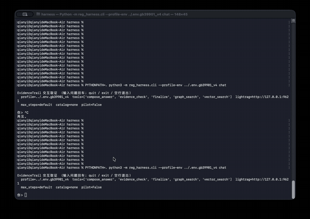

# EvidenceTrail

[English](README.md) | **中文**

基于知识图谱增强检索的文档取证 Agent。

面向法规、试验规范等确定性知识：回答须可回溯至原文；证据不足时拒答。

---

## 0. 系统概览

```text
┌─────────────────────────────────────────────────────────────────┐
│                         EvidenceTrail                           │
│                                                                 │
│   PDF ──► OCR ──► Markdown ──► 结构切分 / 入库                   │
│            │                      │                             │
│            │ MinerU               ▼                             │
│            │              ┌──────────────┐  ┌────────────────┐  │
│            │              │ 知识图谱+向量 │◄─│ 领域 schema    │  │
│            │              │ LightRAG     │  │ 关系约束       │  │
│            │              └──────┬───────┘  └────────────────┘  │
│                                  │ 检索                         │
│                                  ▼                              │
│                           ┌──────────────┐                      │
│                           │ Harness Agent│ 规划→检索→反思→门控  │
│                           └──────┬───────┘                      │
│                                  ▼                              │
│                           有据回答 / 拒答                        │
│                                  │                              │
│                                  ▼                              │
│                           ┌──────────────┐                      │
│                           │  Benchmark   │ 离线评测              │
│                           └──────────────┘                      │
└─────────────────────────────────────────────────────────────────┘
```

架构图：[docs/architecture.svg](docs/architecture.svg)

CLI 交互录屏：



```bash
cd harness
PYTHONPATH=. python3 -m reg_harness.cli --profile-env ../.env.gb39901_v4 chat
```

v4 知识图谱（Neo4j，`aeb_gb39901_v4_relation_guard`）：

| | |
|--|--|
| [总览](docs/screenshots/neo4j-v4-overview.png) | 条款 / 要求 / 阈值 / 试验等类型子图 |
| [6.11 邻域](docs/screenshots/neo4j-v4-focus-6.11.png) | 误响应相关局部关联 |


---

## 1. 问题背景

智能驾驶、车载知识问答及试验规范、标定、诊断等场景中，常见问题包括：工况速度阈值、误触发判定、试验要求差异等。答案通常已写在标准或手册中，属于闭集、可核对知识。若仅依赖模型参数记忆，可能出现条款虚构、数值偏移。

目标：回答严格依据已入库文档；证据不足时明确拒答。

---

## 2. 方案

### 2.1 RAG

从知识库检索相关片段，再据此生成回答。

```text
问题 ──► 检索 ──► 生成
```

常见实现是单次「问题 → 检索 → 生成」。对长文档与表格密集文本，一轮检索易漏检；切分不当会导致阈值错读；上下文噪声可能诱发无依据生成。

### 2.2 Agent 控制环

在检索底座之上增加 Harness Agent，将单次问答改为多步取证：

```text
传统 RAG:   问题 ──► 检索 ──► 回答

EvidenceTrail:
  问题 ──► Harness（规划 → 检索 → 反思 → 再决策）──► 有据回答 / 拒答
                    │
                    └──► 图 + 向量检索底座
```

| | 传统 RAG | EvidenceTrail |
|--|----------|----------------|
| 流程 | 单次检索与生成 | 多轮规划、检索与反思 |
| 查询构造 | 多以整句问题检索 | Agent 拆分子问题并选择检索方式 |
| 证据不足 | 易给出确定回答 | 继续取证，或明确拒答 |
| 职责划分 | 检索 + 一次生成 | 检索底座 + 控制层 |

### 2.3 知识图谱、GraphRAG 与 LightRAG

知识图谱以实体为节点、关系为边，便于表达「要求—试验—条件—阈值」等结构。GraphRAG 在向量相似之外用图做关联扩展，再回到原文片段生成。

```text
文档 ──► 切分 / 抽取 ──► 知识图谱 + 向量索引
                              │
                   查询：图扩展关联 ──► 原文片段 ──► 生成
```

底座采用开源 [LightRAG](https://github.com/HKUDS/LightRAG)。领域实体类型、关系合法性及表格切分在应用侧约束。本仓库不修改 LightRAG 核心源码。

### 2.4 PDF 与 OCR

原始材料多为 PDF，需 OCR / 版面解析为 Markdown 后再切分与构图。工具使用 [MinerU](https://github.com/opendatalab/MinerU)：

| 方式 | 链接 |
|------|------|
| 在线 | [https://mineru.net/](https://mineru.net/) |
| 本地 | [https://github.com/opendatalab/MinerU](https://github.com/opendatalab/MinerU) |

```text
PDF ──► MinerU ──► Markdown ──► 结构切分 / 入库
```

样例语料在 `corpus/prepared/`、`corpus/index_ready/`（历史导出文件名可能含 `PaddleOCR-VL` 标记；新文档可用 MinerU）。

### 2.5 构图：默认流程与应用侧改进

LightRAG 默认：按长度切块 → 宽类型抽取 → 图 + 向量。用于法规文档时，常见问题是表被切散、类型过泛、关系噪声、数值与条件分离。

应用侧改进（不改核心源码）：

| 改进 | 做法 | 目的 |
|------|------|------|
| 结构切分 | 表整表入库；叙述按条款/单元切分（`prepare_gb39901_v3.py`） | 阈值与条件对齐 |
| 领域 schema | 条款、试验、阈值等类型与提示（`config/gb_39901_2025_schema.yml`） | 抽取业务对象 |
| 关系校验 | 白名单；keep / reverse / drop，禁止 invent（`schema_guard.py`） | 减少非法边 |
| 图检索 + 原文回源 | 图定位后回填完整 text unit | 作答依据为原文 |

```text
PDF ──► OCR ──► 结构切分 ──► schema 抽取 ──► 关系校验 ──► 图 + 向量
查询：图扩展 ──► 回源原文 ──► Agent 取证 / 门控
```

换领域时主要改 schema 与切分；控制层可复用。v4 构图结果见上文截图。

### 2.6 控制层与评测隔离

控制层定义角色、工具、拒答条件与步数上限，不把具体题解写入在线规则。换语料时换索引与 schema，不换贴题脚本。约定见 [harness/PROTOCOL.md](harness/PROTOCOL.md)。

```text
在线：Agent 只读索引与原文 ──► 作答
离线：标准答案 / 参考证据 ──► 事后打分
```

| 项 | 默认 |
|----|------|
| 决策路径 | skill（`HARNESS_PILOT_HEURISTICS=0`） |
| 证据 catalog | `none`（不加载金标） |
| 条款/表格精查 | 关闭（`HARNESS_ENABLE_PRECISE_LOOKUP=0`） |

报告档位：P0 裸检索基线；**P1** 协议 Agent（主结论）；P2 贴题/gold catalog（仅附录）。

---

## 3. Benchmark

目录：`benchmark/`。评测分两阶段，职责不同。

### 3.1 两阶段

```text
阶段一：金标小批量 → score_kg / retrieval / answers → 迭代构图或 Agent
阶段二：题量扩大 → RAGAS 等 reference-free 指标（规划中，脚本未入库）
```

| 阶段 | 数据 | 工具 | 目的 |
|------|------|------|------|
| 一 | 金标题目与证据 | 自建分层评分 | 诊断与定型 |
| 二 | 大规模题目 | [RAGAS](https://docs.ragas.io/) 类指标 | 回归与趋势 |

阶段二不替代阶段一；扩集后仍保留金标抽检。RAGAS 衡量相对上下文的忠实度/切题程度，不等于法规判定正确。评分均在事后进行。

### 3.2 检索模式与纪律

| 模式 | 作用 |
|------|------|
| `closed_book` | 无检索地板 |
| `naive` | 纯向量 |
| `hybrid` / `mix` | 图增强 |
| `oracle` | 金证据上限 |

主张图增益时，应同时看证据召回、路径完整与最终答案。`KG 分高 ≠ 检索好 ≠ 答对`。

当前以 pilot 小集与分层脚本为主，`self_checked`，未冻结 formal v1。详见 [benchmark/README.md](benchmark/README.md)、[pilot_6q_report.md](benchmark/results/pilot_6q_report.md)。

### 3.3 数据与脚本

| 路径 | 说明 |
|------|------|
| [benchmark/data/questions.jsonl](benchmark/data/questions.jsonl) | 题目与参考答案 |
| [benchmark/data/evidence.jsonl](benchmark/data/evidence.jsonl) | 参考证据 |
| [benchmark/scripts/score_kg.py](benchmark/scripts/score_kg.py) | 图谱评分 |
| [benchmark/scripts/score_retrieval.py](benchmark/scripts/score_retrieval.py) | 检索评分 |
| [benchmark/scripts/score_answers.py](benchmark/scripts/score_answers.py) | 问答评分 |
| [benchmark/scripts/run_harness_benchmark.py](benchmark/scripts/run_harness_benchmark.py) | Agent 跑题 |
| [benchmark/scripts/run_graphrag_benchmark.py](benchmark/scripts/run_graphrag_benchmark.py) | 多 mode 管线 |

### 3.4 题型示例

| 题型 | 题号 | 题目 |
|------|------|------|
| 直接事实 | `gb_direct_001` | GB 39901—2025 适用于哪两类汽车？ |
| 条件表格 | `gb_table_001` | M1、60 km/h、静止目标、最大设计总质量下最大相对碰撞速度？ |
| 多跳 | `gb_multi_hop_001` | 车辆目标碰撞预警的验证试验、相对紧急制动的最迟时机及例外？ |
| 比较 | `gb_compare_001` | M1 与 N1 前方车辆目标最低激活速度范围差异？VRU 目标是否相同？ |
| 综合 | `gb_synthesis_001` / `gb_multi_hop_006` | 6.11 与 5.4 关系、子场景与共同判据 |
| 不可回答 | `gb_unanswerable_001` | 能否用仿真完全替代 6.11 五项误响应试验？ |

不可回答类用于检验拒答。高召回不保证会拒答。

### 3.5 Pilot 观察

图检索可提高证据覆盖，也可能引入噪声；结构切分与关系约束改善读表与图合法性，不自动提高问答正确率。效果依赖重排序、原文优先、充分性收网、门控与多步 Agent。详见 [pilot_6q_report.md](benchmark/results/pilot_6q_report.md)。

---

## 4. 运行时

控制环：模型决策工具；代码负责入袋、配额、充分性与门控。标准答案不进入在线路径。

检索上图定位、扩关联；作答时数字与表行以 `kind=chunk` 原文为准，entity / relationship 仅作辅证。

### 4.1 控制环

| 工具 | 默认 | 说明 |
|------|------|------|
| `graph_search` | 开，mode=`mix` | 图增强检索 |
| `vector_search` | 开，mode=`naive` | 纯向量 |
| `evidence_check` | 开 | 袋内检查 |
| `compose_answer` | 开 | 基于证据袋作答 |
| `finalize` | 开 | 拒答等终局 |
| `clause_lookup` / `table_lookup` | 关 | 需显式开启精查 |

```text
问题 → 决策 → graph/vector 检索 → source_id 回源 chunk
     → compact（去重 / 重排 / text-primary）
     → 充分性 / 收网 → compose → 门控 → 答案
     未充分则换 query 再检
```

### 4.2 证据袋

| kind | 用途 |
|------|------|
| `relationship` / `entity` | 导航与辅证 |
| `chunk` | 事实与数值主依据（含回源全文） |

图模式常出现「有实体关系、无 text unit」，故默认 `mix` 并做 `source_id` 回源。实现：`lightrag_retrieve.py`、`compact.py`、`types.evidence_text`、`compose_answer.py`。

### 4.3 充分性与收网

代码审袋（`sufficiency.py`、`bag_gaps.py`）：硬缺口示例为题干条款未入袋、「见表 N」无表体。充分性是防空转启发式，不保证语义正确。

| 条件（有袋） | 行为 |
|--------------|------|
| 停滞 ≥ 2 | 软提示收网 |
| 重复检索 ≥ 2 或停滞 ≥ 3 | 强制 compose |
| 已充分且仍停滞 / 本轮无新增 | 强制 compose |

空袋不强制 compose；步数耗尽则拒答或强制 compose（有袋时）。

### 4.4 硬门控

| 规则 | 行为 |
|------|------|
| 空袋 compose | 拒绝 |
| 答案数字 ≥ 5 | 须在袋全文出现（含千分位归一） |
| 未接地 | 可继续取证，不静默放过 |
| `finalize` | 不得绕过 compose 硬答 |

### 4.5 示例：误响应相关

```text
问题（5.4 与 6.11 关系 / 子场景 / 共同判据）
  → graph_search → 回源 → 充分性 → compose → 门控
```

轨迹可写文件：`--dump-trace path.json`。

---

## 5. 仓库结构

```text
harness/           # Agent
lightrag_custom/   # 抽取提示、关系校验
config/            # 领域 schema
scripts/           # 切分、入库、后处理
benchmark/         # 评测
corpus/            # 样例语料
data/rag_storage/  # v4 向量/KV 快照（无 LLM cache）
docs/              # 架构图、截图、CLI 录屏
docker/            # 可选薄镜像
compose.yaml
Makefile
```

| 仓内 | 不含 |
|------|------|
| 应用代码、schema、prepared 语料、v4 快照、benchmark 数据与报告 | LightRAG 源码、Neo4j 卷、`.env`、raw PDF、非 v4 workspace、LLM cache |

见 [NOTICE.md](NOTICE.md)、[CONTRIBUTING.md](CONTRIBUTING.md)。

---

## 6. 运行

### 6.1 拓扑

```text
Docker: Neo4j :7474/:7687 · LightRAG :9621（挂载 rag_storage、lightrag_custom）
Python: reg_harness ──HTTP──► LightRAG
```

| 方式 | 命令 |
|------|------|
| 默认 | `make v4-up`（官方 LightRAG 镜像） |
| 薄应用镜像 | `make lightrag-image` && `make v4-up-app` |

说明：[docker/README.md](docker/README.md)。本地 Neo4j Browser：`http://127.0.0.1:7474`。

### 6.2 配置

依赖：Docker、Python 3.10+、对话与向量 API。

```bash
git clone https://github.com/qianyi0206/evidence-trail.git
cd evidence-trail

pip install -r requirements.txt
cd harness && pip install -e . && cd ..

cp .env.example .env
# NEO4J_PASSWORD、LLM_*、EMBEDDING_*；可选 RERANK_*
```

无密钥叠加配置：`.env.gb39901_v4`。

### 6.3 步骤

```text
1. cd harness && python3 -m unittest discover -s tests -v
2. （可选）MinerU 转 Markdown → corpus/prepared/
3. make v4-up
4. 图为空：make v4-prepare && make v4-ingest …
5. cd harness && PYTHONPATH=. python3 -m reg_harness.cli \
     --profile-env ../.env.gb39901_v4 chat
6. （可选）benchmark/scripts/ …
```

单次提问（默认输出取证过程；规划阶段可流式打印模型 token，`--no-live` 关闭）：

```bash
cd harness
PYTHONPATH=. python3 -m reg_harness.cli --profile-env ../.env.gb39901_v4 \
  ask "系统无误响应要求与6.11试验是什么关系？6.11包含多少类子场景，共同通过行为是什么？" \
  --max-steps 8

PYTHONPATH=. python3 -m reg_harness.cli --profile-env ../.env.gb39901_v4 \
  ask "GB 39901—2025 适用于哪两类汽车？" --max-steps 6
```

```python
from reg_harness import build_stack

stack = build_stack(profile_env=".env.gb39901_v4")
state = stack.ask("GB 39901 适用于哪两类汽车？", max_steps=6)
print(state.final_answer)
```

使用仓内向量快照时，嵌入模型与维度须与入库一致（`state/embedding_fingerprint*.json`）。

---

## 7. 范围

- 工程演示，非量产知识中台或认证工具。
- 门控降低无依据生成风险，不保证零错误。
- 未冻结 formal 总正确率，见 [benchmark/results/pilot_6q_report.md](benchmark/results/pilot_6q_report.md)。
- 样例语料仅供学习研究：[NOTICE.md](NOTICE.md)。
- [CONTRIBUTING.md](CONTRIBUTING.md) · [MIT](LICENSE) · [harness/PROTOCOL.md](harness/PROTOCOL.md)
