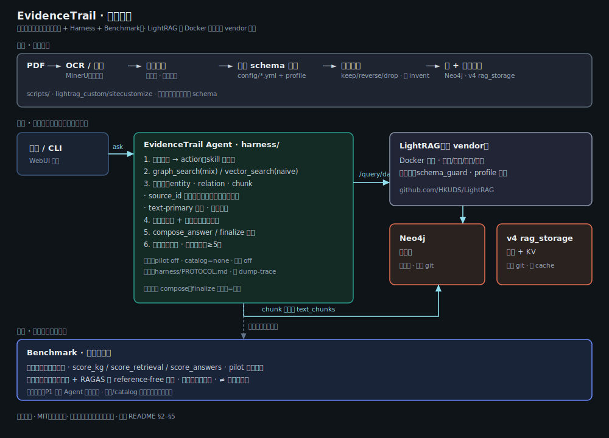

# EvidenceTrail 架构

**EvidenceTrail** = 基于 GraphRAG 的文档取证 Agent（Agentic RAG）。  
本页说明应用层（本仓库）与依赖 **LightRAG** 的边界。



## 分层

```text
┌─────────────────────────────────────────────────────────────────┐
│  User / CLI / (optional) LightRAG WebUI                         │
└────────────────────────────┬────────────────────────────────────┘
                             │
         ┌───────────────────┴───────────────────┐
         ▼                                       ▼
┌─────────────────────┐               ┌─────────────────────┐
│  EvidenceTrail      │               │  LightRAG API       │
│  (reg_harness)      │── /query* ──► │  Docker image       │
│  plan→tool→audit    │               │  (not vendored)     │
│  → compose / gate   │               └──────────┬──────────┘
└─────────────────────┘                          │
                                                 ▼
                                    ┌────────────────────────┐
                                    │ Neo4j (graph) +        │
                                    │ NanoVector / JSON KV   │
                                    │ workspace: v4 only in  │
                                    │ git snapshot           │
                                    └────────────────────────┘
```

## Agent 控制环（证据轨迹）

```text
question
  → decision LLM (JSON action)
  → tools: graph_search | vector_search | evidence_check | compose | finalize
  → post-retrieve sufficiency audit (code)
  → if sufficient / spin detected → force compose
  → numeric grounding guards on final JSON
  → trace = evidence trail
```

| 组件 | 路径 | 职责 |
|------|------|------|
| Loop + 强制 compose | `harness/reg_harness/loop.py` | 编排 |
| 充足性审核 | `harness/reg_harness/sufficiency.py` | 袋是否已够 |
| 门控 | `harness/reg_harness/guards.py` | 空袋 / 未接地数字 |
| Schema guard | `lightrag_custom/schema_guard.py` | 抽取时关系端点过滤 |
| Benchmark | `benchmark/` | 离线金标与打分（默认不进在线） |

## Data in git vs local

| Artifact | In git? |
|----------|---------|
| Prepared corpus + index units | Yes |
| v4 `rag_storage` (no LLM cache) | Yes |
| Neo4j volume | **No** — rebuild with Docker + ingest |
| `.env` secrets | **No** |

## Related docs

- [README.md](../README.md) — quick start  
- [harness/ARCHITECTURE.md](../harness/ARCHITECTURE.md) — package layout  
- [harness/PROTOCOL.md](../harness/PROTOCOL.md) — control-layer rules  
