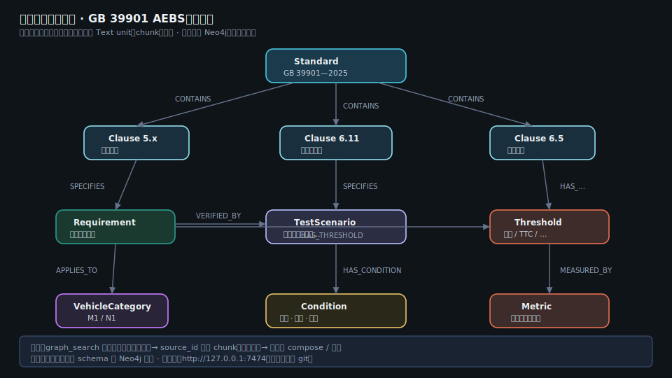

# EvidenceTrail 架构

**EvidenceTrail** = 基于 GraphRAG 的文档取证 Agent。  
本页说明应用层（本仓库）与依赖 **LightRAG** 的边界。更完整的叙事与配置见根 [README.md](../README.md)。


领域图谱示意（样例关系，非全量导出）：



图中三层：

1. **离线入图**：PDF → OCR（推荐 MinerU）→ 结构切分 → 领域 schema → 关系守卫 → Neo4j + v4 向量/KV  
2. **在线取证**：Harness（规划 → 检索 → 证据袋/回源 → 充分性收网 → compose/门控）→ LightRAG `/query/data`  
3. **离线评测**：金标分层评分；RAGAS 为扩集规划；**默认不进入在线路径**

## 分层（文字）

```text
┌─────────────────────────────────────────────────────────────────┐
│  用户 / CLI /（可选）LightRAG WebUI                             │
└────────────────────────────┬────────────────────────────────────┘
                             │ ask（无金标）
         ┌───────────────────┴───────────────────┐
         ▼                                       ▼
┌─────────────────────┐               ┌─────────────────────┐
│  EvidenceTrail      │── /query* ──► │  LightRAG API       │
│  harness/           │               │  Docker 镜像        │
│  规划→袋→审→门控     │               │  （不 vendor）      │
└─────────────────────┘               └──────────┬──────────┘
                                                 ▼
                                    ┌────────────────────────┐
                                    │ Neo4j（本地，不进 git）  │
                                    │ v4 rag_storage（可进仓） │
                                    └────────────────────────┘
```

## Agent 控制环（证据轨迹）

```text
问题
  → 决策模型（JSON action，skill 默认）
  → graph_search | vector_search |（精查默认关）
  → 入袋 + source_id 回源 chunk + 配额/重排
  → 充分性审核 / 收网阶梯（代码）
  → compose_answer 或 finalize 拒答
  → 硬门控（空袋 / 数值接地）
  → 轨迹（可 --dump-trace）
```

| 组件 | 路径 | 职责 |
|------|------|------|
| Loop + 强制 compose | `harness/reg_harness/loop.py` | 编排与收网 |
| 充分性审核 | `harness/reg_harness/sufficiency.py` | 防空转启发式 |
| 证据袋渲染 | `harness/reg_harness/types.py` | chunk 优先 / for_compose |
| 门控 | `harness/reg_harness/guards.py` | 空袋 / 未接地数字 |
| Schema guard | `lightrag_custom/schema_guard.py` | 关系端点；不 invent |
| Benchmark | `benchmark/` | 离线金标与打分 |

## 仓内有 / 仓内无

| 产物 | 是否进 git |
|------|------------|
| prepared / index 语料 | 是 |
| v4 `rag_storage`（无 LLM cache） | 是 |
| Neo4j 卷 | **否** — Docker 重建 |
| `.env` 密钥 | **否** |
| LightRAG 源码 | **否** — 官方镜像 |

## 相关文档

- [README.md](../README.md) — 完整说明  
- [harness/PROTOCOL.md](../harness/PROTOCOL.md) — 控制层纪律  
- [harness/ARCHITECTURE.md](../harness/ARCHITECTURE.md) — 包结构  
- [NOTICE.md](../NOTICE.md) · [CONTRIBUTING.md](../CONTRIBUTING.md)  

